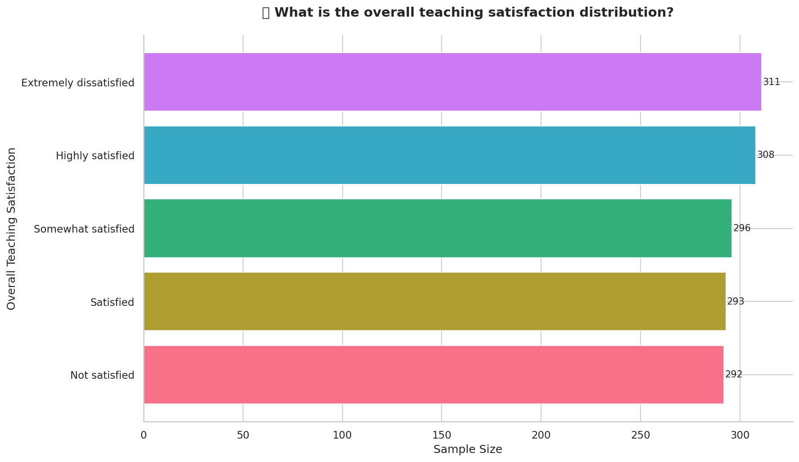
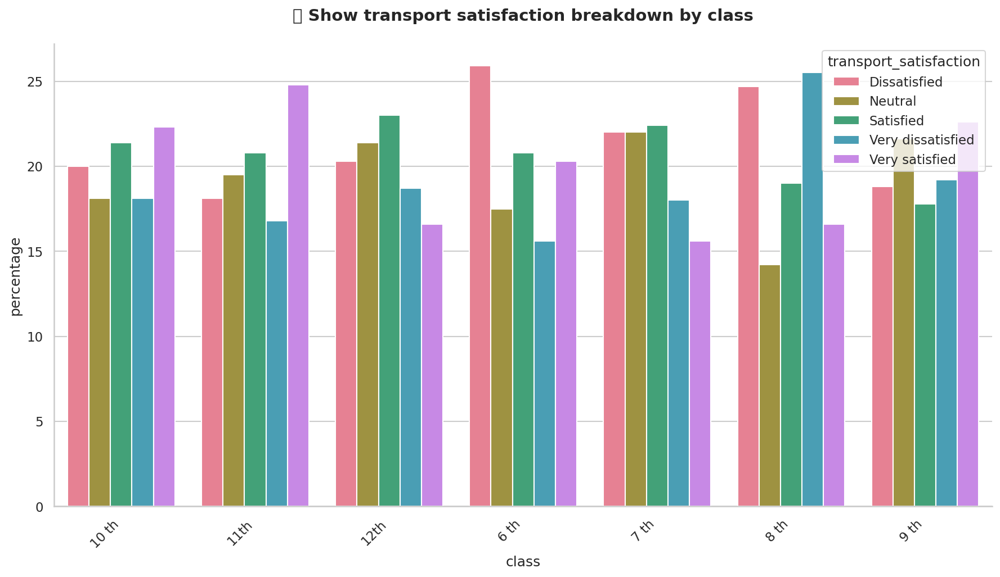
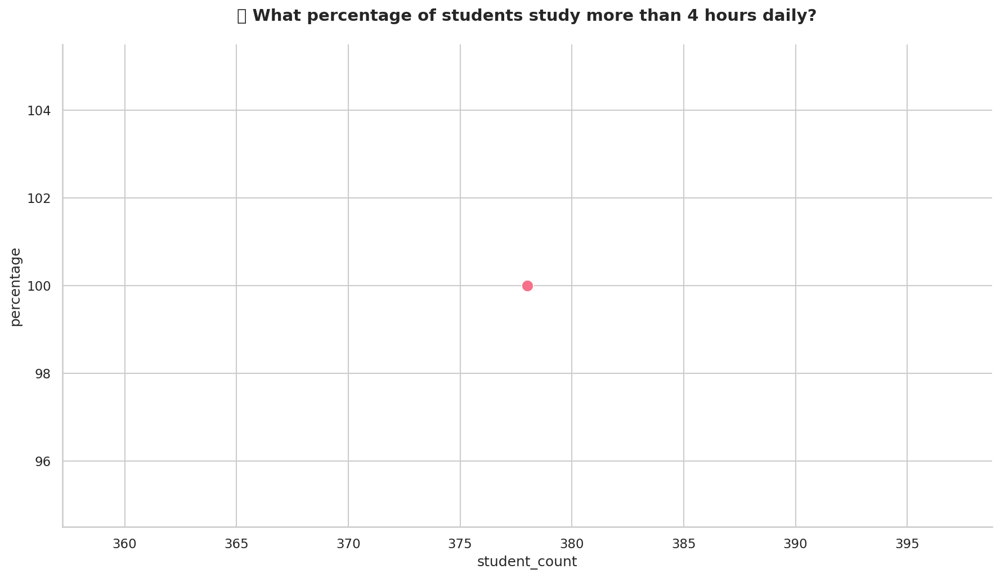
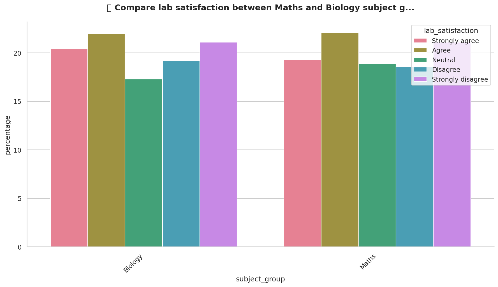
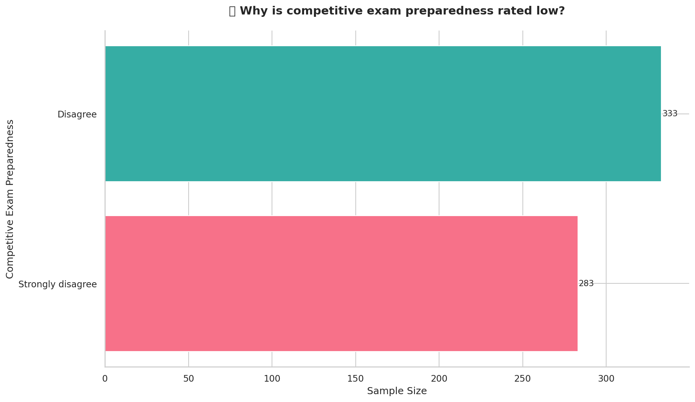
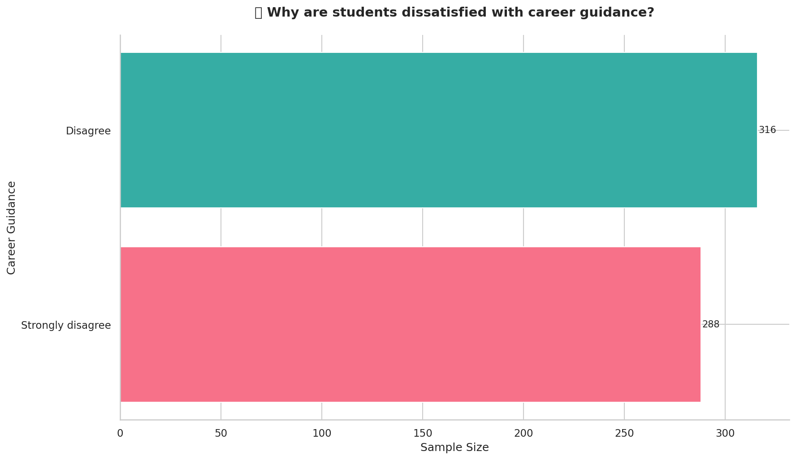
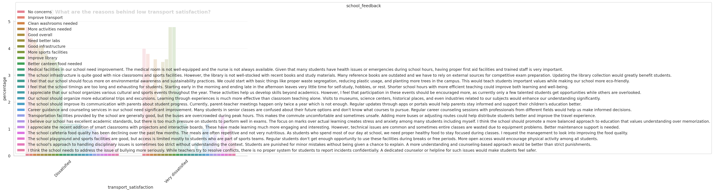

# 🎓 SMART Survey Copilot - Test Results

**Test Date:** January 31, 2026 at 13:39:33
**Total Queries Tested:** 10
**Successful:** 10
**Failed:** 0
**Charts Generated:** 7

---

## 📑 Table of Contents

| # | Query | Intent | Status | Chart |
|---|-------|--------|--------|-------|
| 1 | What is the overall teaching satisf... | `QUANT` | ✅ | 📊 |
| 2 | Show transport satisfaction breakdo... | `QUANT` | ✅ | 📊 |
| 3 | What percentage of students study m... | `QUANT` | ✅ | 📊 |
| 4 | Compare lab satisfaction between Ma... | `QUANT` | ✅ | 📊 |
| 5 | What do students complain about reg... | `QUAL` | ✅ | — |
| 6 | What suggestions do students have f... | `QUAL` | ✅ | — |
| 7 | What are the common issues with sch... | `QUAL` | ✅ | — |
| 8 | Why is competitive exam preparednes... | `MIXED` | ✅ | 📊 |
| 9 | Why are students dissatisfied with ... | `MIXED` | ✅ | 📊 |
| 10 | What are the reasons behind low tra... | `MIXED` | ✅ | 📊 |

---

## 📊 Detailed Results

### Test 1: QUANT Query

**📝 Question:**
> What is the overall teaching satisfaction distribution?

**🔍 Detected Intent:** `QUANT`

**📈 Generated Chart:**



**✅ Response:**

```
Sample Size: 1500

Overall Teaching Satisfaction Distribution:
- Extremely dissatisfied: 20.7% (311 students)
- Highly satisfied: 20.5% (308 students)
- Not satisfied: 19.5% (292 students)
- Satisfied: 19.5% (293 students)
- Somewhat satisfied: 19.7% (296 students)
```


---

### Test 2: QUANT Query

**📝 Question:**
> Show transport satisfaction breakdown by class

**🔍 Detected Intent:** `QUANT`

**📈 Generated Chart:**



**✅ Response:**

```
Sample Size: 1500

**Class 6th:**
- Dissatisfied: 25.9% (55 students)
- Neutral: 17.5% (37 students)
- Satisfied: 20.8% (44 students)
- Very dissatisfied: 15.6% (33 students)
- Very satisfied: 20.3% (43 students)

**Class 7th:**
- Dissatisfied: 22.0% (45 students)
- Neutral: 22.0% (45 students)
- Satisfied: 22.4% (46 students)
- Very dissatisfied: 18.0% (37 students)
- Very satisfied: 15.6% (32 students)

**Class 8th:**
- Dissatisfied: 24.7% (61 students)
- Neutral: 14.2% (35 students)
- Satisfied: 19.0% (47 students)
- Very dissatisfied: 25.5% (63 students)
- Very satisfied: 16.6% (41 students)

**Class 9th:**
- Dissatisfied: 18.8% (39 students)
- Neutral: 21.6% (45 students)
- Satisfied: 17.8% (37 students)
- Very dissatisfied: 19.2% (40 students)
- Very satisfied: 22.6% (47 students)

**Class 10th:**
- Dissatisfied: 20.0% (43 students)
- Neutral: 18.1% (39 students)
- Satisfied: 21.4% (46 students)
- Very dissatisfied: 18.1% (39 students)
- Very satisfied: 22.3% (48 students)

**Class 11th:**
- Dissatisfied: 18.1% (41 students)
- Neutral: 19.5% (44 students)
- Satisfied: 20.8% (47 students)
- Very dissatisfied: 16.8% (38 students)
- Very satisfied: 24.8% (56 students)

**Class 12th:**
- Dissatisfied: 20.3% (38 students)
- Neutral: 21.4% (40 students)
- Satisfied: 23.0% (43 students)
- Very dissatisfied: 18.7% (35 students)
- Very satisfied: 16.6% (31 students)
```


---

### Test 3: QUANT Query

**📝 Question:**
> What percentage of students study more than 4 hours daily?

**🔍 Detected Intent:** `QUANT`

**📈 Generated Chart:**



**✅ Response:**

```
- Sample Size: 378 students
- 100% (378 students) study more than 4 hours daily
```


---

### Test 4: QUANT Query

**📝 Question:**
> Compare lab satisfaction between Maths and Biology subject groups

**🔍 Detected Intent:** `QUANT`

**📈 Generated Chart:**



**✅ Response:**

```
Sample Size: 1500

Biology Lab Satisfaction:
- Strongly agree: 10.9% (66 students)
- Agree: 11.7% (71 students)
- Neutral: 9.2% (56 students)
- Disagree: 10.2% (62 students)
- Strongly disagree: 11.2% (68 students)

Maths Lab Satisfaction:
- Strongly agree: 9.0% (55 students)
- Agree: 10.4% (63 students)
- Neutral: 8.9% (54 students)
- Disagree: 8.7% (53 students)
- Strongly disagree: 9.9% (60 students)
```


---

### Test 5: QUAL Query

**📝 Question:**
> What do students complain about regarding teachers?

**🔍 Detected Intent:** `QUAL`

**✅ Response:**

```
📝 **Feedback Analysis** (based on 10 relevant responses)

The feedback highlights two main themes. Firstly, there is a positive sentiment towards teachers being readily available for doubt-solving sessions after class, indicating appreciation for their accessibility and support. Secondly, there is a concern that shy students do not receive enough attention during regular class hours, suggesting a need for teachers to proactively engage with quieter students to ensure they are keeping up with the lessons. This feedback suggests that teachers could implement strategies to involve all students more equally during class time.

**Sample Feedback:**
• "I appreciate that teachers are always available for doubt solving after class, but I feel that students who are shy don't get enough attention during regular class hours. Maybe teachers could check on quieter students more often to see if they are following the lessons properly."
• "I appreciate that teachers are always available for doubt solving after class, but I feel that students who are shy don't get enough attention during regular class hours. Maybe teachers could check on quieter students more often to see if they are following the lessons properly."
• "I appreciate that teachers are always available for doubt solving after class, but I feel that students who are shy don't get enough attention during regular class hours. Maybe teachers could check on quieter students more often to see if they are following the lessons properly."
```

**📋 Vector Search Results with Full Metadata:**

| # | Student | Class | Subject Group | Satisfaction | Study Time | Similarity |
|---|---------|-------|---------------|--------------|------------|------------|
| 1 | Kavita Tripathi | 12th | Not Applicab | Extremely dissa | 3-4 Hrs | 0.5154 |
| 2 | Suresh Gupta | 10 th | Commerce | Highly satisfie | More than  | 0.5154 |
| 3 | Sanjay Sharma | 9 th | Biology | Extremely dissa | 2-3 Hrs | 0.5154 |
| 4 | Aakash Yadav | 7 th | Not Applicab | Extremely dissa | 2-3 Hrs | 0.5154 |
| 5 | Karan Kumar | 12th | Commerce | Highly satisfie | <2 Hrs | 0.5154 |
| 6 | Amit Rastogi | 11th | Maths | Highly satisfie | 3-4 Hrs | 0.5154 |
| 7 | Pooja Singh | 9 th | IT/CS | Satisfied | 2-3 Hrs | 0.5154 |
| 8 | Aditya Agarwal | 6 th | Maths | Highly satisfie | 2-3 Hrs | 0.5154 |
| 9 | Mohit Pandey | 7 th | Maths | Not satisfied | More than  | 0.5154 |
| 10 | Kunal Mishra | 8 th | Biology | Satisfied | <2 Hrs | 0.5154 |

**📝 Detailed Feedback with Full Context:**

<details>
<summary><strong>Result 1: Kavita Tripathi (12th)</strong></summary>

| Field | Value |
|-------|-------|
| **ID** | 1086 |
| **Student Name** | Kavita Tripathi |
| **School** | JNV VARANASI |
| **Class** | 12th |
| **Subject Group** | Not Applicable |
| **Study Time** | 3-4 Hrs |
| **Toughest Subject** | Physics |
| **Teacher Support** | Strongly agree |
| **Transport Satisfaction** | Very dissatisfied |
| **Career Guidance** | Neutral |
| **Competitive Exam Prep** | Strongly disagree |
| **Overall Satisfaction** | Extremely dissatisfied |
| **Recommendation Score** | 4 |
| **Similarity Score** | 0.5154 |

**Feedback:**
> I appreciate that teachers are always available for doubt solving after class, but I feel that students who are shy don't get enough attention during regular class hours. Maybe teachers could check on quieter students more often to see if they are following the lessons properly.

</details>

<details>
<summary><strong>Result 2: Suresh Gupta (10 th)</strong></summary>

| Field | Value |
|-------|-------|
| **ID** | 1035 |
| **Student Name** | Suresh Gupta |
| **School** | JNV VARANASI |
| **Class** | 10 th |
| **Subject Group** | Commerce |
| **Study Time** | More than 4 Hrs |
| **Toughest Subject** | Accountancy |
| **Teacher Support** | Agree |
| **Transport Satisfaction** | Very dissatisfied |
| **Career Guidance** | Agree |
| **Competitive Exam Prep** | Disagree |
| **Overall Satisfaction** | Highly satisfied |
| **Recommendation Score** | 4 |
| **Similarity Score** | 0.5154 |

**Feedback:**
> I appreciate that teachers are always available for doubt solving after class, but I feel that students who are shy don't get enough attention during regular class hours. Maybe teachers could check on quieter students more often to see if they are following the lessons properly.

</details>

<details>
<summary><strong>Result 3: Sanjay Sharma (9 th)</strong></summary>

| Field | Value |
|-------|-------|
| **ID** | 831 |
| **Student Name** | Sanjay Sharma |
| **School** | JNV VARANASI |
| **Class** | 9 th |
| **Subject Group** | Biology |
| **Study Time** | 2-3 Hrs |
| **Toughest Subject** | IT/CS |
| **Teacher Support** | Strongly agree |
| **Transport Satisfaction** | Very satisfied |
| **Career Guidance** | Neutral |
| **Competitive Exam Prep** | Strongly agree |
| **Overall Satisfaction** | Extremely dissatisfied |
| **Recommendation Score** | 3 |
| **Similarity Score** | 0.5154 |

**Feedback:**
> I appreciate that teachers are always available for doubt solving after class, but I feel that students who are shy don't get enough attention during regular class hours. Maybe teachers could check on quieter students more often to see if they are following the lessons properly.

</details>


---

### Test 6: QUAL Query

**📝 Question:**
> What suggestions do students have for improving the school?

**🔍 Detected Intent:** `QUAL`

**✅ Response:**

```
📝 **Feedback Analysis** (based on 10 relevant responses)

The primary theme in the student feedback is the urgent need for a proper, anonymous feedback system. Students express a strong desire for a channel to voice their concerns and suggestions about teachers and school policies without fear of repercussions. There is a unanimous sentiment that regular surveys could significantly enhance the quality of the school environment. The feedback indicates a lack of current mechanisms for student input, highlighting a critical area for improvement.

**Sample Feedback:**
• "I suggest implementing a proper feedback system where students can anonymously share their concerns and suggestions about teachers and school policies. Currently, there is no official channel for students to voice their opinions without fear of consequences. Regular surveys would help improve school quality."
• "I suggest implementing a proper feedback system where students can anonymously share their concerns and suggestions about teachers and school policies. Currently, there is no official channel for students to voice their opinions without fear of consequences. Regular surveys would help improve school quality."
• "I suggest implementing a proper feedback system where students can anonymously share their concerns and suggestions about teachers and school policies. Currently, there is no official channel for students to voice their opinions without fear of consequences. Regular surveys would help improve school quality."
```

**📋 Vector Search Results with Full Metadata:**

| # | Student | Class | Subject Group | Satisfaction | Study Time | Similarity |
|---|---------|-------|---------------|--------------|------------|------------|
| 1 | Ritu Sharma | 8 th | IT/CS | Satisfied | <2 Hrs | 0.6825 |
| 2 | Suresh Tiwari | 11th | Commerce | Highly satisfie | <2 Hrs | 0.6825 |
| 3 | Neha Kapoor | 11th | Commerce | Not satisfied | <2 Hrs | 0.6825 |
| 4 | Vikas Kapoor | 7 th | Maths | Somewhat satisf | 2-3 Hrs | 0.6825 |
| 5 | Sneha Kumar | 9 th | Maths | Extremely dissa | More than  | 0.6825 |
| 6 | Nisha Kapoor | 12th | Not Applicab | Highly satisfie | 3-4 Hrs | 0.6825 |
| 7 | Kunal Kapoor | 6 th | Biology | Not satisfied | <2 Hrs | 0.6825 |
| 8 | Aakash Gupta | 7 th | Commerce | Not satisfied | 2-3 Hrs | 0.6825 |
| 9 | Priya Pandey | 6 th | Not Applicab | Highly satisfie | More than  | 0.6825 |
| 10 | Aditya Pandey | 8 th | IT/CS | Highly satisfie | 3-4 Hrs | 0.6825 |

**📝 Detailed Feedback with Full Context:**

<details>
<summary><strong>Result 1: Ritu Sharma (8 th)</strong></summary>

| Field | Value |
|-------|-------|
| **ID** | 1159 |
| **Student Name** | Ritu Sharma |
| **School** | JNV VARANASI |
| **Class** | 8 th |
| **Subject Group** | IT/CS |
| **Study Time** | <2 Hrs |
| **Toughest Subject** | English |
| **Teacher Support** | Strongly agree |
| **Transport Satisfaction** | Very satisfied |
| **Career Guidance** | Strongly disagree |
| **Competitive Exam Prep** | Neutral |
| **Overall Satisfaction** | Satisfied |
| **Recommendation Score** | 1 |
| **Similarity Score** | 0.6825 |

**Feedback:**
> I suggest implementing a proper feedback system where students can anonymously share their concerns and suggestions about teachers and school policies. Currently, there is no official channel for students to voice their opinions without fear of consequences. Regular surveys would help improve school quality.

</details>

<details>
<summary><strong>Result 2: Suresh Tiwari (11th)</strong></summary>

| Field | Value |
|-------|-------|
| **ID** | 1214 |
| **Student Name** | Suresh Tiwari |
| **School** | JNV VARANASI |
| **Class** | 11th |
| **Subject Group** | Commerce |
| **Study Time** | <2 Hrs |
| **Toughest Subject** | Chemistry |
| **Teacher Support** | Strongly agree |
| **Transport Satisfaction** | Neutral |
| **Career Guidance** | Agree |
| **Competitive Exam Prep** | Disagree |
| **Overall Satisfaction** | Highly satisfied |
| **Recommendation Score** | 5 |
| **Similarity Score** | 0.6825 |

**Feedback:**
> I suggest implementing a proper feedback system where students can anonymously share their concerns and suggestions about teachers and school policies. Currently, there is no official channel for students to voice their opinions without fear of consequences. Regular surveys would help improve school quality.

</details>

<details>
<summary><strong>Result 3: Neha Kapoor (11th)</strong></summary>

| Field | Value |
|-------|-------|
| **ID** | 985 |
| **Student Name** | Neha Kapoor |
| **School** | JNV VARANASI |
| **Class** | 11th |
| **Subject Group** | Commerce |
| **Study Time** | <2 Hrs |
| **Toughest Subject** | Maths |
| **Teacher Support** | Neutral |
| **Transport Satisfaction** | Dissatisfied |
| **Career Guidance** | Neutral |
| **Competitive Exam Prep** | Strongly disagree |
| **Overall Satisfaction** | Not satisfied |
| **Recommendation Score** | 5 |
| **Similarity Score** | 0.6825 |

**Feedback:**
> I suggest implementing a proper feedback system where students can anonymously share their concerns and suggestions about teachers and school policies. Currently, there is no official channel for students to voice their opinions without fear of consequences. Regular surveys would help improve school quality.

</details>


---

### Test 7: QUAL Query

**📝 Question:**
> What are the common issues with school facilities?

**🔍 Detected Intent:** `QUAL`

**✅ Response:**

```
📝 **Feedback Analysis** (based on 10 relevant responses)

The feedback highlights two main themes regarding school facilities. First, there is a positive sentiment towards the addition of smart classrooms equipped with projectors and interactive boards, as they enhance the learning experience by making it more engaging and interesting. However, a significant issue is the frequent technical problems with this equipment, leading to wasted class time. An actionable recommendation is to improve maintenance support to ensure these technological tools function reliably.

**Sample Feedback:**
• "I appreciate the recent addition of smart classrooms with projectors and interactive boards. These have made learning much more engaging and interesting. However, technical issues are common and sometimes entire classes are wasted due to equipment problems. Better maintenance support is needed."
• "I appreciate the recent addition of smart classrooms with projectors and interactive boards. These have made learning much more engaging and interesting. However, technical issues are common and sometimes entire classes are wasted due to equipment problems. Better maintenance support is needed."
• "I appreciate the recent addition of smart classrooms with projectors and interactive boards. These have made learning much more engaging and interesting. However, technical issues are common and sometimes entire classes are wasted due to equipment problems. Better maintenance support is needed."
```

**📋 Vector Search Results with Full Metadata:**

| # | Student | Class | Subject Group | Satisfaction | Study Time | Similarity |
|---|---------|-------|---------------|--------------|------------|------------|
| 1 | Sneha Yadav | 6 th | Not Applicab | Somewhat satisf | More than  | 0.5651 |
| 2 | Karan Chaudhary | 10 th | Maths | Extremely dissa | More than  | 0.5651 |
| 3 | Aakash Rastogi | 7 th | Maths | Highly satisfie | 2-3 Hrs | 0.5651 |
| 4 | Karan Tiwari | 10 th | Commerce | Extremely dissa | 2-3 Hrs | 0.5651 |
| 5 | Abhishek Verma | 11th | Biology | Satisfied | More than  | 0.5651 |
| 6 | Sneha Mehta | 9 th | IT/CS | Somewhat satisf | 2-3 Hrs | 0.5651 |
| 7 | Kunal Rastogi | 6 th | Biology | Highly satisfie | 2-3 Hrs | 0.5651 |
| 8 | Anjali Bansal | 8 th | IT/CS | Not satisfied | 3-4 Hrs | 0.5651 |
| 9 | Rahul Kapoor | 8 th | Maths | Highly satisfie | 2-3 Hrs | 0.5651 |
| 10 | Shivam Mishra | 8 th | Biology | Somewhat satisf | More than  | 0.5651 |

**📝 Detailed Feedback with Full Context:**

<details>
<summary><strong>Result 1: Sneha Yadav (6 th)</strong></summary>

| Field | Value |
|-------|-------|
| **ID** | 571 |
| **Student Name** | Sneha Yadav |
| **School** | JNV VARANASI |
| **Class** | 6 th |
| **Subject Group** | Not Applicable |
| **Study Time** | More than 4 Hrs |
| **Toughest Subject** | Social Science |
| **Teacher Support** | Disagree |
| **Transport Satisfaction** | Dissatisfied |
| **Career Guidance** | Neutral |
| **Competitive Exam Prep** | Neutral |
| **Overall Satisfaction** | Somewhat satisfied |
| **Recommendation Score** | 4 |
| **Similarity Score** | 0.5651 |

**Feedback:**
> I appreciate the recent addition of smart classrooms with projectors and interactive boards. These have made learning much more engaging and interesting. However, technical issues are common and sometimes entire classes are wasted due to equipment problems. Better maintenance support is needed.

</details>

<details>
<summary><strong>Result 2: Karan Chaudhary (10 th)</strong></summary>

| Field | Value |
|-------|-------|
| **ID** | 681 |
| **Student Name** | Karan Chaudhary |
| **School** | JNV VARANASI |
| **Class** | 10 th |
| **Subject Group** | Maths |
| **Study Time** | More than 4 Hrs |
| **Toughest Subject** | Economics |
| **Teacher Support** | Disagree |
| **Transport Satisfaction** | Dissatisfied |
| **Career Guidance** | Strongly disagree |
| **Competitive Exam Prep** | Disagree |
| **Overall Satisfaction** | Extremely dissatisfied |
| **Recommendation Score** | 2 |
| **Similarity Score** | 0.5651 |

**Feedback:**
> I appreciate the recent addition of smart classrooms with projectors and interactive boards. These have made learning much more engaging and interesting. However, technical issues are common and sometimes entire classes are wasted due to equipment problems. Better maintenance support is needed.

</details>

<details>
<summary><strong>Result 3: Aakash Rastogi (7 th)</strong></summary>

| Field | Value |
|-------|-------|
| **ID** | 289 |
| **Student Name** | Aakash Rastogi |
| **School** | JNV VARANASI |
| **Class** | 7 th |
| **Subject Group** | Maths |
| **Study Time** | 2-3 Hrs |
| **Toughest Subject** | Accountancy |
| **Teacher Support** | Agree |
| **Transport Satisfaction** | Satisfied |
| **Career Guidance** | Disagree |
| **Competitive Exam Prep** | Neutral |
| **Overall Satisfaction** | Highly satisfied |
| **Recommendation Score** | 2 |
| **Similarity Score** | 0.5651 |

**Feedback:**
> I appreciate the recent addition of smart classrooms with projectors and interactive boards. These have made learning much more engaging and interesting. However, technical issues are common and sometimes entire classes are wasted due to equipment problems. Better maintenance support is needed.

</details>


---

### Test 8: MIXED Query

**📝 Question:**
> Why is competitive exam preparedness rated low?

**🔍 Detected Intent:** `MIXED`

**📈 Generated Chart:**



**✅ Response:**

```
📊 **Metrics** (n=1500)
  • competitive_exam_preparedness: Disagree, sample_size: 333, percentage: 54.1
  • competitive_exam_preparedness: Strongly disagree, sample_size: 283, percentage: 45.9

💬 **Feedback Insights** (10 relevant responses)
The primary issue highlighted in the feedback is the inadequacy of the library's resources, specifically the lack of up-to-date books and study materials necessary for competitive exam preparation. This has led students to rely on external sources, indicating a negative sentiment towards the current library offerings. An actionable recommendation is to update the library's collection with recent reference books and study materials to better support students' exam readiness. Overall, while the school infrastructure is positively viewed, the library's shortcomings are a significant concern for students.

**Examples:**
• "The school infrastructure is quite good with nice classrooms and sports facilities. However, the library is not well-stocked with recent books and study materials. Many reference books are outdated and we have to rely on external sources for competitive exam preparation. Updating the library collection would greatly benefit students."
• "The school infrastructure is quite good with nice classrooms and sports facilities. However, the library is not well-stocked with recent books and study materials. Many reference books are outdated and we have to rely on external sources for competitive exam preparation. Updating the library collection would greatly benefit students."
• "The school infrastructure is quite good with nice classrooms and sports facilities. However, the library is not well-stocked with recent books and study materials. Many reference books are outdated and we have to rely on external sources for competitive exam preparation. Updating the library collection would greatly benefit students."
```

**📋 Vector Search Results with Full Metadata:**

| # | Student | Class | Subject Group | Satisfaction | Study Time | Similarity |
|---|---------|-------|---------------|--------------|------------|------------|
| 1 | Anjali Jain | 12th | IT/CS | Highly satisfie | 3-4 Hrs | 0.4569 |
| 2 | Ramesh Pandey | 7 th | Not Applicab | Not satisfied | <2 Hrs | 0.4569 |
| 3 | Vikas Tiwari | 6 th | Maths | Satisfied | 3-4 Hrs | 0.4568 |
| 4 | Nitin Singh | 11th | Commerce | Somewhat satisf | 2-3 Hrs | 0.4568 |
| 5 | Rohit Bansal | 12th | Commerce | Extremely dissa | More than  | 0.4568 |
| 6 | Vivek Sharma | 9 th | Biology | Satisfied | 3-4 Hrs | 0.4568 |
| 7 | Karan Sharma | 10 th | Biology | Somewhat satisf | 3-4 Hrs | 0.4568 |
| 8 | Riya Srivastava | 6 th | Maths | Satisfied | 3-4 Hrs | 0.4568 |
| 9 | Mohit Pandey | 7 th | Maths | Not satisfied | More than  | 0.4568 |
| 10 | Pooja Mishra | 9 th | IT/CS | Extremely dissa | More than  | 0.4568 |

**📝 Detailed Feedback with Full Context:**

<details>
<summary><strong>Result 1: Anjali Jain (12th)</strong></summary>

| Field | Value |
|-------|-------|
| **ID** | 367 |
| **Student Name** | Anjali Jain |
| **School** | JNV VARANASI |
| **Class** | 12th |
| **Subject Group** | IT/CS |
| **Study Time** | 3-4 Hrs |
| **Toughest Subject** | Maths |
| **Teacher Support** | Strongly disagree |
| **Transport Satisfaction** | Satisfied |
| **Career Guidance** | Strongly agree |
| **Competitive Exam Prep** | Strongly agree |
| **Overall Satisfaction** | Highly satisfied |
| **Recommendation Score** | 4 |
| **Similarity Score** | 0.4569 |

**Feedback:**
> I believe our school has excellent academic standards, but there is too much pressure on students to perform well in exams. The focus on marks over actual learning creates stress and anxiety among many students including myself. I think the school should promote a more balanced approach to education that values understanding over memorization.

</details>

<details>
<summary><strong>Result 2: Ramesh Pandey (7 th)</strong></summary>

| Field | Value |
|-------|-------|
| **ID** | 562 |
| **Student Name** | Ramesh Pandey |
| **School** | JNV VARANASI |
| **Class** | 7 th |
| **Subject Group** | Not Applicable |
| **Study Time** | <2 Hrs |
| **Toughest Subject** | Physics |
| **Teacher Support** | Disagree |
| **Transport Satisfaction** | Very dissatisfied |
| **Career Guidance** | Disagree |
| **Competitive Exam Prep** | Strongly disagree |
| **Overall Satisfaction** | Not satisfied |
| **Recommendation Score** | 5 |
| **Similarity Score** | 0.4569 |

**Feedback:**
> I believe our school has excellent academic standards, but there is too much pressure on students to perform well in exams. The focus on marks over actual learning creates stress and anxiety among many students including myself. I think the school should promote a more balanced approach to education that values understanding over memorization.

</details>

<details>
<summary><strong>Result 3: Vikas Tiwari (6 th)</strong></summary>

| Field | Value |
|-------|-------|
| **ID** | 1490 |
| **Student Name** | Vikas Tiwari |
| **School** | JNV VARANASI |
| **Class** | 6 th |
| **Subject Group** | Maths |
| **Study Time** | 3-4 Hrs |
| **Toughest Subject** | IT/CS |
| **Teacher Support** | Disagree |
| **Transport Satisfaction** | Satisfied |
| **Career Guidance** | Agree |
| **Competitive Exam Prep** | Agree |
| **Overall Satisfaction** | Satisfied |
| **Recommendation Score** | 3 |
| **Similarity Score** | 0.4568 |

**Feedback:**
> I believe our school has excellent academic standards, but there is too much pressure on students to perform well in exams. The focus on marks over actual learning creates stress and anxiety among many students including myself. I think the school should promote a more balanced approach to education that values understanding over memorization.

</details>


---

### Test 9: MIXED Query

**📝 Question:**
> Why are students dissatisfied with career guidance?

**🔍 Detected Intent:** `MIXED`

**📈 Generated Chart:**



**✅ Response:**

```
📊 **Metrics** (n=1500)
  • career_guidance: Strongly disagree, sample_size: 288, percentage: 47.7
  • career_guidance: Disagree, sample_size: 316, percentage: 52.3

💬 **Feedback Insights** (10 relevant responses)
The primary theme from the feedback is a strong dissatisfaction with the current career guidance and counseling services, as students feel these services are inadequate. There is a clear sentiment of confusion and uncertainty among senior students regarding their future career paths and course selections. An actionable suggestion from the feedback is the implementation of regular career counseling sessions featuring professionals from various fields, which could provide students with the necessary information to make informed decisions about their futures. Overall, the feedback indicates a need for more structured and diverse career guidance offerings.

**Examples:**
• "Career guidance and counseling services in our school need significant improvement. Many students in senior classes are confused about their future options and don't know what courses to pursue. Regular career counseling sessions with professionals from different fields would help us make informed decisions."
• "Career guidance and counseling services in our school need significant improvement. Many students in senior classes are confused about their future options and don't know what courses to pursue. Regular career counseling sessions with professionals from different fields would help us make informed decisions."
• "Career guidance and counseling services in our school need significant improvement. Many students in senior classes are confused about their future options and don't know what courses to pursue. Regular career counseling sessions with professionals from different fields would help us make informed decisions."
```

**📋 Vector Search Results with Full Metadata:**

| # | Student | Class | Subject Group | Satisfaction | Study Time | Similarity |
|---|---------|-------|---------------|--------------|------------|------------|
| 1 | Kavita Srivasta | 11th | Maths | Highly satisfie | 3-4 Hrs | 0.6433 |
| 2 | Suresh Agarwal | 6 th | Commerce | Highly satisfie | More than  | 0.6433 |
| 3 | Anjali Sharma | 6 th | Biology | Somewhat satisf | 3-4 Hrs | 0.6433 |
| 4 | Vivek Singh | 7 th | Commerce | Somewhat satisf | 3-4 Hrs | 0.6433 |
| 5 | Pooja Chaudhary | 8 th | Not Applicab | Not satisfied | 3-4 Hrs | 0.6433 |
| 6 | Vikas Bansal | 11th | IT/CS | Somewhat satisf | 3-4 Hrs | 0.6433 |
| 7 | Manish Kumar | 7 th | Not Applicab | Not satisfied | <2 Hrs | 0.6433 |
| 8 | Amit Jain | 12th | Commerce | Extremely dissa | 2-3 Hrs | 0.6433 |
| 9 | Abhishek Singh | 8 th | Commerce | Highly satisfie | More than  | 0.6433 |
| 10 | Amit Rastogi | 9 th | IT/CS | Somewhat satisf | 2-3 Hrs | 0.6433 |

**📝 Detailed Feedback with Full Context:**

<details>
<summary><strong>Result 1: Kavita Srivastava (11th)</strong></summary>

| Field | Value |
|-------|-------|
| **ID** | 1127 |
| **Student Name** | Kavita Srivastava |
| **School** | JNV VARANASI |
| **Class** | 11th |
| **Subject Group** | Maths |
| **Study Time** | 3-4 Hrs |
| **Toughest Subject** | Business Studies |
| **Teacher Support** | Agree |
| **Transport Satisfaction** | Very dissatisfied |
| **Career Guidance** | Strongly agree |
| **Competitive Exam Prep** | Disagree |
| **Overall Satisfaction** | Highly satisfied |
| **Recommendation Score** | 1 |
| **Similarity Score** | 0.6433 |

**Feedback:**
> Career guidance and counseling services in our school need significant improvement. Many students in senior classes are confused about their future options and don't know what courses to pursue. Regular career counseling sessions with professionals from different fields would help us make informed decisions.

</details>

<details>
<summary><strong>Result 2: Suresh Agarwal (6 th)</strong></summary>

| Field | Value |
|-------|-------|
| **ID** | 1180 |
| **Student Name** | Suresh Agarwal |
| **School** | JNV VARANASI |
| **Class** | 6 th |
| **Subject Group** | Commerce |
| **Study Time** | More than 4 Hrs |
| **Toughest Subject** | Chemistry |
| **Teacher Support** | Strongly agree |
| **Transport Satisfaction** | Very satisfied |
| **Career Guidance** | Strongly disagree |
| **Competitive Exam Prep** | Agree |
| **Overall Satisfaction** | Highly satisfied |
| **Recommendation Score** | 4 |
| **Similarity Score** | 0.6433 |

**Feedback:**
> Career guidance and counseling services in our school need significant improvement. Many students in senior classes are confused about their future options and don't know what courses to pursue. Regular career counseling sessions with professionals from different fields would help us make informed decisions.

</details>

<details>
<summary><strong>Result 3: Anjali Sharma (6 th)</strong></summary>

| Field | Value |
|-------|-------|
| **ID** | 990 |
| **Student Name** | Anjali Sharma |
| **School** | JNV VARANASI |
| **Class** | 6 th |
| **Subject Group** | Biology |
| **Study Time** | 3-4 Hrs |
| **Toughest Subject** | Maths |
| **Teacher Support** | Strongly disagree |
| **Transport Satisfaction** | Neutral |
| **Career Guidance** | Neutral |
| **Competitive Exam Prep** | Disagree |
| **Overall Satisfaction** | Somewhat satisfied |
| **Recommendation Score** | 1 |
| **Similarity Score** | 0.6433 |

**Feedback:**
> Career guidance and counseling services in our school need significant improvement. Many students in senior classes are confused about their future options and don't know what courses to pursue. Regular career counseling sessions with professionals from different fields would help us make informed decisions.

</details>


---

### Test 10: MIXED Query

**📝 Question:**
> What are the reasons behind low transport satisfaction?

**🔍 Detected Intent:** `MIXED`

**📈 Generated Chart:**



**✅ Response:**

```
📊 **Metrics** (n=1500)
  • transport_satisfaction: Very dissatisfied, sample_size: 29, percentage: 4.8, school_feedback: More sports facilities
  • transport_satisfaction: Very dissatisfied, sample_size: 29, percentage: 4.8, school_feedback: Improve library
  • transport_satisfaction: Dissatisfied, sample_size: 29, percentage: 4.8, school_feedback: No concerns
  • transport_satisfaction: Dissatisfied, sample_size: 27, percentage: 4.4, school_feedback: Improve transport
  • transport_satisfaction: Dissatisfied, sample_size: 26, percentage: 4.3, school_feedback: Clean washrooms needed
  • transport_satisfaction: Dissatisfied, sample_size: 25, percentage: 4.1, school_feedback: More activities needed
  • transport_satisfaction: Dissatisfied, sample_size: 25, percentage: 4.1, school_feedback: Good overall
  • transport_satisfaction: Very dissatisfied, sample_size: 24, percentage: 4.0, school_feedback: No concerns
  • transport_satisfaction: Dissatisfied, sample_size: 23, percentage: 3.8, school_feedback: Need better labs
  • transport_satisfaction: Very dissatisfied, sample_size: 23, percentage: 3.8, school_feedback: Improve transport

💬 **Feedback Insights** (10 relevant responses)
The primary issue affecting transport satisfaction is overcrowding on school buses during peak hours, leading to uncomfortable and potentially unsafe conditions. Students consistently suggest that adding more buses or adjusting current routes could alleviate this problem by better distributing the number of passengers. Overall, while the sentiment towards the transportation facilities is generally positive, addressing the overcrowding concern is crucial for improving the overall travel experience.

**Examples:**
• "Transportation facilities provided by the school are generally good, but the buses are overcrowded during peak hours. This makes the commute uncomfortable and sometimes unsafe. Adding more buses or adjusting routes could help distribute students better and improve the travel experience."
• "Transportation facilities provided by the school are generally good, but the buses are overcrowded during peak hours. This makes the commute uncomfortable and sometimes unsafe. Adding more buses or adjusting routes could help distribute students better and improve the travel experience."
• "Transportation facilities provided by the school are generally good, but the buses are overcrowded during peak hours. This makes the commute uncomfortable and sometimes unsafe. Adding more buses or adjusting routes could help distribute students better and improve the travel experience."
```

**📋 Vector Search Results with Full Metadata:**

| # | Student | Class | Subject Group | Satisfaction | Study Time | Similarity |
|---|---------|-------|---------------|--------------|------------|------------|
| 1 | Mohit Jain | 7 th | Maths | Extremely dissa | More than  | 0.4401 |
| 2 | Amit Verma | 10 th | IT/CS | Highly satisfie | 3-4 Hrs | 0.4401 |
| 3 | Pooja Gupta | 12th | Not Applicab | Satisfied | <2 Hrs | 0.4401 |
| 4 | Mohit Bansal | 9 th | Maths | Extremely dissa | <2 Hrs | 0.4401 |
| 5 | Amit Chaudhary | 10 th | Maths | Extremely dissa | <2 Hrs | 0.4401 |
| 6 | Ramesh Kumar | 10 th | IT/CS | Highly satisfie | More than  | 0.4401 |
| 7 | Anjali Malhotra | 6 th | Commerce | Somewhat satisf | More than  | 0.4401 |
| 8 | Priya Mehta | 6 th | IT/CS | Highly satisfie | More than  | 0.4401 |
| 9 | Sneha Sharma | 7 th | Not Applicab | Satisfied | <2 Hrs | 0.4401 |
| 10 | Ritu Agarwal | 7 th | Commerce | Satisfied | 2-3 Hrs | 0.4401 |

**📝 Detailed Feedback with Full Context:**

<details>
<summary><strong>Result 1: Mohit Jain (7 th)</strong></summary>

| Field | Value |
|-------|-------|
| **ID** | 4 |
| **Student Name** | Mohit Jain |
| **School** | JNV VARANASI |
| **Class** | 7 th |
| **Subject Group** | Maths |
| **Study Time** | More than 4 Hrs |
| **Toughest Subject** | Chemistry |
| **Teacher Support** | Neutral |
| **Transport Satisfaction** | Very satisfied |
| **Career Guidance** | Strongly agree |
| **Competitive Exam Prep** | Neutral |
| **Overall Satisfaction** | Extremely dissatisfied |
| **Recommendation Score** | 5 |
| **Similarity Score** | 0.4401 |

**Feedback:**
> Transportation facilities provided by the school are generally good, but the buses are overcrowded during peak hours. This makes the commute uncomfortable and sometimes unsafe. Adding more buses or adjusting routes could help distribute students better and improve the travel experience.

</details>

<details>
<summary><strong>Result 2: Amit Verma (10 th)</strong></summary>

| Field | Value |
|-------|-------|
| **ID** | 1000 |
| **Student Name** | Amit Verma |
| **School** | JNV VARANASI |
| **Class** | 10 th |
| **Subject Group** | IT/CS |
| **Study Time** | 3-4 Hrs |
| **Toughest Subject** | Other |
| **Teacher Support** | Disagree |
| **Transport Satisfaction** | Dissatisfied |
| **Career Guidance** | Disagree |
| **Competitive Exam Prep** | Neutral |
| **Overall Satisfaction** | Highly satisfied |
| **Recommendation Score** | 2 |
| **Similarity Score** | 0.4401 |

**Feedback:**
> Transportation facilities provided by the school are generally good, but the buses are overcrowded during peak hours. This makes the commute uncomfortable and sometimes unsafe. Adding more buses or adjusting routes could help distribute students better and improve the travel experience.

</details>

<details>
<summary><strong>Result 3: Pooja Gupta (12th)</strong></summary>

| Field | Value |
|-------|-------|
| **ID** | 402 |
| **Student Name** | Pooja Gupta |
| **School** | JNV VARANASI |
| **Class** | 12th |
| **Subject Group** | Not Applicable |
| **Study Time** | <2 Hrs |
| **Toughest Subject** | Maths |
| **Teacher Support** | Disagree |
| **Transport Satisfaction** | Satisfied |
| **Career Guidance** | Agree |
| **Competitive Exam Prep** | Strongly agree |
| **Overall Satisfaction** | Satisfied |
| **Recommendation Score** | 3 |
| **Similarity Score** | 0.4401 |

**Feedback:**
> Transportation facilities provided by the school are generally good, but the buses are overcrowded during peak hours. This makes the commute uncomfortable and sometimes unsafe. Adding more buses or adjusting routes could help distribute students better and improve the travel experience.

</details>


---

## 📈 Summary Statistics

### Results by Intent Type

| Intent | Total | Successful | Success Rate | Charts Generated |
|--------|-------|------------|--------------|------------------|
| `QUANT` | 4 | 4 | 100.0% | 4 |
| `QUAL` | 3 | 3 | 100.0% | 0 |
| `MIXED` | 3 | 3 | 100.0% | 3 |

### 📊 Charts Gallery

All generated charts are saved in the `smart_outputs/` folder:

- **What is the overall teaching satisfactio...** → `smart_outputs/chart_What is the overall teaching s_20260131_133831.png`
- **Show transport satisfaction breakdown by...** → `smart_outputs/chart_Show transport satisfaction br_20260131_133836.png`
- **What percentage of students study more t...** → `smart_outputs/chart_What percentage of students st_20260131_133844.png`
- **Compare lab satisfaction between Maths a...** → `smart_outputs/chart_Compare lab satisfaction betwe_20260131_133848.png`
- **Why is competitive exam preparedness rat...** → `smart_outputs/chart_Why is competitive exam prepar_20260131_133906.png`
- **Why are students dissatisfied with caree...** → `smart_outputs/chart_Why are students dissatisfied _20260131_133916.png`
- **What are the reasons behind low transpor...** → `smart_outputs/chart_What are the reasons behind lo_20260131_133926.png`

---

*Generated by SMART Survey Copilot Test Suite*
*Output folder: `smart_outputs`*